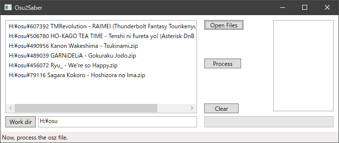

# Osu2Saber
This software converts osu beatmap files (*.osu) to Beat Saber beatmap files.

## Feature
* Automatic Beat Saber beatmaps generation from osu beatmaps
* Generated beatmaps currently support:
    * Notes placement and their cut direction
    * Light control 
    * and being updated continuously!
* Batch process for multiple beatmaps
    * You can make hundreds of beatmaps just in 5 minutes!

## How to Use
1. Download the executable from [GitHub Release](https://github.com/tmokmss/Osu2Saber/releases).
2. Extract all the files in zip and run Osu2Saber.exe.
3. Press "Open Files" button and open valid osu archive files (*.osz or *.zip)
    * You can download them [here (official)](https://osu.ppy.sh/beatmapsets) or [here (unofficial mirror, faster download)](https://bloodcat.com/osu/?q=&c=b&s=&m=&g=&l=)
    * For osu players, you can just compress `osu!\Songs\[ur-favorite-beatmap]` folders respectively into zip files
        * **Caution**: make sure each zip file contains **only one** .mp3 and several .osu for the song
4. The file list you selected should show up, then press "Process" button.

5. Wait until the progress bar is filled
6. When completed, the output folder should be opened. The generated beatmaps are in it.

## Dependency
This software depends on the following open source libraries:
* [osuBMParser](https://github.com/Razacx/osuBMParser)
* [.NET Ogg Vorbis Encoder](https://github.com/SteveLillis/.NET-Ogg-Vorbis-Encoder)